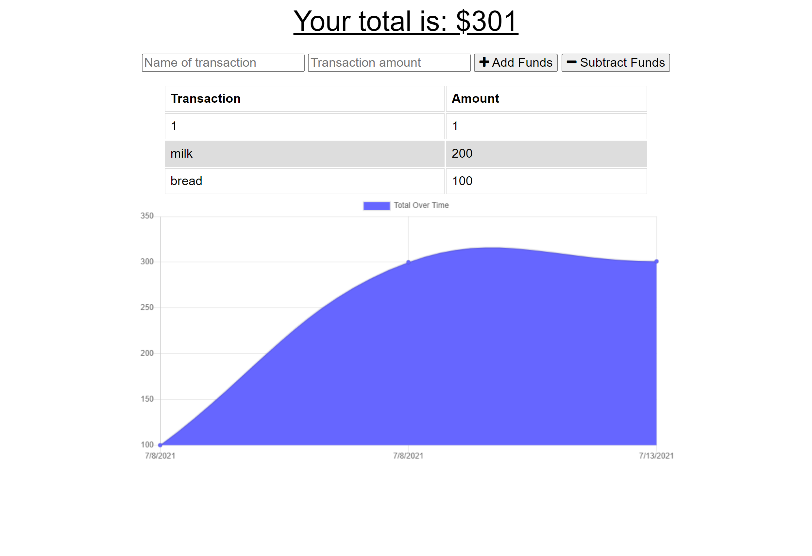

# Project Title

  <h1 align="center">Budge-Tracker generator 👋</h1>

  

    
    
    
    

    
    
    
    
    
    

# Description

  

  PWA (Progressive Web App) Budget Tracker that has online/offline functionality

  

## Table of Contents

* [Installation](#-Installation)
* [Usage](#-Usage)
* [License](#-Installation)
* [Contributing](#-Contributing)
* [Tests](#-Tests)
* [Questions](#-Contact-Information)

## User Story

AS AN avid traveller
I WANT to be able to track my withdrawals and deposits with or without a data/internet connection
SO THAT my account balance is accurate when I am traveling

## Business Context

Giving users a fast and easy way to track their money is important, but allowing them to access that information anytime is even more important. Having offline functionality is paramount to our applications success.

## Acceptance Criteria

GIVEN a user is on Budget App without an internet connection
WHEN the user inputs a withdrawal or deposit
THEN that will be shown on the page, and added to their transaction history when their connection is back online.

## Installation

on your terminal type:

  `{npm install}`

  `{npm start}` (to start it locally)

The App is also deployed on `heroku`(<https://budget-tracker2662.herokuapp.com/>)

## Usage

To create an offline PWA app for budgeting

## License

  Licensed under MIT. 
  For more information, visit this link. 
  <https://opensource.org/licenses/MIT>
  
# Contributing

Solo Project

# Tests

  none at this `version`

# Contact Information

* GitHub Username: MichaelPappas2662
* Contact Email: email@email.com
  